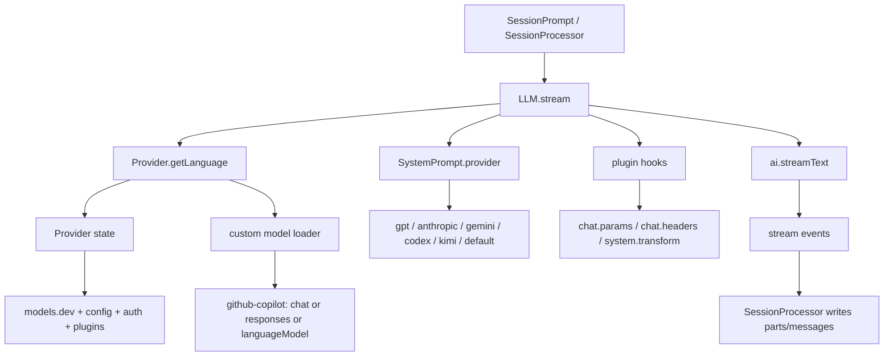

---
tags:
  - opencode
  - llm
  - copilot
  - provider
  - prompt
---

# LLM 调用链分析：GitHub Copilot Provider 与 System Prompt 分流

这篇笔记聚焦两条关键路径：

- 为什么 GitHub Copilot 在这个项目里是一个专门适配的 provider，而不是直接复用标准 OpenAI provider。
- 为什么 system prompt 会按模型类型分流，以及这种分流会怎样影响最终的模型行为。

相关代码主要位于 `packages/opencode/src/provider`、`packages/opencode/src/plugin/github-copilot`、`packages/opencode/src/session`。

## 结论

- GitHub Copilot 在 OpenCode 中不是简单的 OpenAI 兼容 provider，而是一组带有自定义 SDK、动态模型发现、OAuth/fetch/header 适配、tool 兼容补丁的 provider 族。
- 同一个 `providerID = github-copilot` 下，不同模型背后可能走完全不同的调用协议：
  - 自定义 Copilot chat 协议
  - 自定义 Copilot responses 协议
  - Anthropic `/v1/messages` 协议
- system prompt 的分流依据不是 provider，而是 `model.api.id`。因此同一个 provider 下的不同模型会拿到不同 prompt 模板。
- 这两层设计是叠加的：provider 层决定“怎么调用模型”，prompt 层决定“怎么驱动模型行为”。

## 总体调用链



关键入口：

- `packages/opencode/src/session/llm.ts`
- `packages/opencode/src/provider/provider.ts`
- `packages/opencode/src/plugin/github-copilot/copilot.ts`
- `packages/opencode/src/session/system.ts`

## GitHub Copilot 为什么是专门适配的 Provider

### 1. Provider 工厂就是仓库内自定义实现

在 `packages/opencode/src/provider/provider.ts` 中，`@ai-sdk/github-copilot` 不走标准 OpenAI provider，而是映射到：

- `packages/opencode/src/provider/sdk/copilot/copilot-provider.ts`

这个工厂暴露了三个入口：

- `chat(modelId)`
- `responses(modelId)`
- `languageModel(modelId)`

其中 `languageModel(modelId)` 默认回到 chat 模型，而不是 responses 模型。这说明 Copilot 的 provider 工厂本身已经是一个带双协议能力的自定义抽象。

### 2. 真正的 chat/responses 分流在 Provider custom loader

在 `packages/opencode/src/provider/provider.ts` 中，`github-copilot` 的 custom loader 负责决定某个模型到底走哪条 API：

- 如果底层 sdk 只有 `languageModel`，直接走 `sdk.languageModel(modelID)`
- 否则，调用 `shouldUseCopilotResponsesApi(modelID)`
- 返回真时走 `sdk.responses(modelID)`
- 返回假时走 `sdk.chat(modelID)`

`shouldUseCopilotResponsesApi(modelID)` 的规则很收敛：

- 只匹配 `gpt-*`
- 主版本号大于等于 5 时优先 responses
- `gpt-5-mini` 明确排除，仍然走 chat

这意味着 Copilot 的协议选择不是静态的，而是按模型名运行时分流。

### 3. Copilot 模型清单本身就是混合协议

在 `packages/opencode/src/plugin/github-copilot/models.ts` 中，项目会请求 Copilot 的 `/models` 接口，然后根据每个模型的 `supported_endpoints` 动态构造内部模型定义。

核心规则：

- 如果模型支持 `/v1/messages`，则 `api.npm = @ai-sdk/anthropic`
- 否则 `api.npm = @ai-sdk/github-copilot`

这会产生一个非常重要的结果：

- 同样是 `providerID = github-copilot`
- 但 Claude 系 Copilot 模型可能走 Anthropic SDK
- GPT 系 Copilot 模型则走仓库内自定义 Copilot provider

所以 `github-copilot` 不是单一协议 provider，而是上层统一命名、下层多协议复合的 provider 家族。

### 4. Copilot 还有专门的 OAuth 与 fetch/header 适配

在 `packages/opencode/src/plugin/github-copilot/copilot.ts` 中，Copilot 插件注册了专用的 auth loader。这个 loader 不只是返回 token，还会自定义 `fetch`，并在请求前重写 header。

会注入的关键 header 包括：

- `Authorization: Bearer ...`
- `Openai-Intent: conversation-edits`
- `x-initiator: user | agent`
- `Copilot-Vision-Request: true`，仅视觉请求时加入

此外它还会根据请求体判断：

- 这次请求是否由 agent 发起
- 是否包含 image 输入
- 企业版是否需要走 `copilot-api.<enterprise-domain>`

这些都超出了标准 OpenAI provider 的默认职责，因此必须在插件层单独适配。

### 5. Copilot 的 chat 与 responses 实现确实不同

自定义 SDK 下有两套完全独立的 LanguageModel 实现：

- `packages/opencode/src/provider/sdk/copilot/chat/openai-compatible-chat-language-model.ts`
- `packages/opencode/src/provider/sdk/copilot/responses/openai-responses-language-model.ts`

它们的差异不是只有 URL：

- chat 走 `/chat/completions`
- responses 走 Responses API 风格输入
- responses 侧支持更多 provider tool 映射，例如 web search、code interpreter、local shell、image generation
- Copilot 的 reasoning 数据还会通过 `reasoning_opaque`、`reasoning.encrypted_content` 一类字段跨轮次传递

因此这里不是“一个模型类切换 endpoint”，而是两套不同的请求/响应语义层。

### 6. 项目中还散落了多处 Copilot 兼容补丁

除了 provider 与 plugin 主链，还有一些额外分支说明 Copilot 的接口兼容性并不稳定，需要专门照顾：

- `packages/opencode/src/plugin/github-copilot/copilot.ts`
  - GPT 模型会移除 `maxOutputTokens`
  - Anthropic messages shim 不接受 `eager_input_streaming`，因此关闭 tool streaming
- `packages/opencode/src/session/llm.ts`
  - 当消息历史里已有 tool call，但当前无 active tools 时，会给 Copilot 注入 `_noop` 假工具，避免接口校验失败
- `packages/opencode/src/provider/transform.ts`
  - Copilot 单独定义 reasoning effort、reasoning summary、encrypted reasoning include 等 provider options

这些分支共同证明：Copilot 在 OpenCode 中不是“可直接复用的 OpenAI 兼容 provider”，而是需要全链路适配的特例。

## Copilot 的实际调用分流

### 模型发现阶段

`packages/opencode/src/plugin/github-copilot/models.ts`

- 请求 Copilot `/models`
- 过滤 `model_picker_enabled = true` 且未禁用的模型
- 按 `supported_endpoints` 判断模型属于 Anthropic messages 还是 Copilot 自定义协议
- 生成内部 `Model` 结构

### Provider 初始化阶段

`packages/opencode/src/provider/provider.ts`

- 加载 bundled provider 工厂
- 为 `github-copilot` 挂上 custom model loader
- 后续 `getLanguage(model)` 时，才真正选择 `chat`、`responses` 或 `languageModel`

### 请求发送阶段

`packages/opencode/src/session/llm.ts`

- 先拿到 `provider.getLanguage(input.model)`
- 再叠加 system prompt、tools、provider options、plugin headers
- 最终统一进入 `ai.streamText`

### 重要观察

如果只看 `providerID = github-copilot`，是看不出真实底层协议的。必须同时看：

- `model.api.npm`
- `model.api.id`
- `provider.ts` 中的 custom loader 分流
- `copilot.ts` 中的 auth/fetch/header 改写

## System Prompt 为什么按模型类型分流

### 1. 分流规则只看 `model.api.id`

入口在 `packages/opencode/src/session/system.ts`。

匹配顺序如下：

- `gpt-4`、`o1`、`o3` -> `PROMPT_BEAST`
- 其余包含 `gpt` 的模型
  - 若还包含 `codex` -> `PROMPT_CODEX`
  - 否则 -> `PROMPT_GPT`
- 包含 `gemini-` -> `PROMPT_GEMINI`
- 包含 `claude` -> `PROMPT_ANTHROPIC`
- 包含 `trinity` -> `PROMPT_TRINITY`
- 包含 `kimi` -> `PROMPT_KIMI`
- 其他模型 -> `PROMPT_DEFAULT`

注意，这里不是按 `providerID` 分流，而是按模型名分流。

结果就是：

- 同一个 provider 里的不同模型，可以拿到完全不同的 prompt 家族
- 不同 provider 里的同类模型，只要 `api.id` 命名接近，也会拿到同一类 prompt

### 2. Copilot 模型也受这套分流影响

因为分流依据是 `model.api.id`，所以 Copilot 模型会落到不同 prompt：

- Copilot GPT-5 -> GPT prompt
- Copilot Claude -> Anthropic prompt
- Copilot Codex -> Codex prompt
- 如果未来 Copilot 模型名命中 `o1` 或 `o3`，则会拿到 Beast prompt

所以 Copilot 的特化不仅在 provider 层，也在 prompt 层。

### 3. Prompt 模板内容并不只是措辞不同

这些 prompt 模板的差异会直接改变模型行为策略：

- `packages/opencode/src/session/prompt/gpt.txt`
  - 偏工程执行、强调简洁直接、优先行动
- `packages/opencode/src/session/prompt/anthropic.txt`
  - 明确技能加载、docs 查询、WebFetch 使用约束，更像 Anthropic agent 风格
- `packages/opencode/src/session/prompt/codex.txt`
  - 更偏 CLI agent，强调少说、多做、工具导向
- `packages/opencode/src/session/prompt/beast.txt`
  - 偏高强度推理模型，强调持续执行、深度研究、严格验证
- `packages/opencode/src/session/prompt/default.txt`
  - 通用兜底

因此这里不是“换个提示词文件”，而是对不同模型族设置了不同的行为操作系统。

## System Prompt 是怎样进入最终请求的

在 `packages/opencode/src/session/llm.ts` 中，最终 system 文本不是单独来自 `system.ts`，而是按如下顺序拼接：

- 优先使用 `input.agent.prompt`
- 否则使用 `SystemPrompt.provider(input.model)` 返回的 provider prompt
- 再拼入 `input.system`
- 再拼入 `input.user.system`

之后还会经过插件 hook：

- `experimental.chat.system.transform`

因此 `system.ts` 只负责基底模板选择，不负责最终完整 system 文本。

## AI SDK 是核心抽象层

`streamText` 来自 **Vercel AI SDK (`ai` 包, 版本 ~6.0)**，它是整个调用的核心抽象：

- 统一了不同 Provider (OpenAI/Anthropic/Google等) 的调用接口
- 内置 tool calling 解析与执行
- 流式事件标准化 (`text-delta`, `reasoning-delta`, `tool-call`, `tool-result` 等)
- 通过 `wrapLanguageModel` 支持 middleware 扩展

在 `packages/opencode/src/session/llm.ts` 中：

```typescript
return streamText({
  model: wrapLanguageModel({
    model: language,
    middleware: [...],
  }),
  messages,
  tools,
  // ...
})
```

## 成本追踪机制

每次 `finish-step` 事件会调用 `Session.getUsage()` 计算本轮 cost (`packages/opencode/src/session/processor.ts:358-365`)：

```typescript
const usage = Session.getUsage({
  model: ctx.model,
  usage: value.usage,
  metadata: value.providerMetadata,
})
ctx.assistantMessage.cost += usage.cost
ctx.assistantMessage.tokens = usage.tokens
```

成本模型来自 `src/provider/transform.ts` 中定义的 `ProviderCost` 结构，包括 input/output/cache 价格。

## OpenCode 托管模型 (ProviderID = "opencode")

`providerID = opencode` 是一个特殊 Provider (`provider.ts:153-175`):

- 可以配置免费模型 (`cost.input === 0`)
- 支持 API Key 或 OAuth 认证
- 背后走 opencode 自己的 API 代理 (`https://opencode.cloudflare.dev`)
- 常用于开发测试或免费 tier

当请求 header 包含 `x-opencode-project`、`x-opencode-session` 时，请求会路由到 OpenCode 托管服务。

## Tool 执行是流式的一部分

**关键点**: 工具调用不是传统的"请求-响应"模式，而是在 `streamText` 的流式事件流中实时执行：

```
tool-input-start → tool-call → tool-input-end → [执行工具] → tool-result
```

这使得 AI 可以在生成过程中动态决定调用哪些工具，而不是预先定义。SessionProcessor 会：

1. 捕获 `tool-call` 事件，创建待执行的 tool part
2. 执行工具 (通过 `t.execute(...)`)
3. 捕获 `tool-result` 事件，将结果传回模型

工具执行的错误也会通过 `tool-error` 事件传回，模型可以选择重试或调整。

## 重试策略

`SessionRetry` 机制 (`src/session/retry.ts`) 提供了:

- 指数退避 (exponential backoff)
- 特定错误类型的重试策略 (rate limit, timeout, server error)
- 状态恢复 (会保存处理中的消息状态)

重试策略通过 `Effect.retry(SessionRetry.policy({...}))` 挂在 SessionProcessor 的执行流上。

## 两条设计如何叠加

把这两件事放在一起看，才能理解 OpenCode 的真实 LLM 架构：

1. Provider 层先决定某个模型应该用哪种 SDK 与哪种协议发请求。
2. Prompt 层再根据模型名选择合适的行为模板。
3. Plugin hook 层继续改写参数、headers 和 system。
4. 最终统一通过 `ai.streamText` 发出请求。

所以：

- provider 层决定“怎么连这个模型”
- prompt 层决定“怎么驱动这个模型”
- plugin hook 层决定“本次请求还要不要做供应商特化修正”

## 风险与维护点

### 1. Copilot 模型协议是动态的

`packages/opencode/src/plugin/github-copilot/models.ts` 是按 Copilot `/models` 实时发现的。只要 GitHub 侧调整 `supported_endpoints`，内部模型的 `api.npm` 就可能改变。

这意味着：

- 某个原本走自定义 Copilot provider 的模型，可能改为走 Anthropic SDK
- 相关 prompt、tool streaming、reasoning option 行为也会连带变化

### 2. Prompt 分流是字符串匹配

`packages/opencode/src/session/system.ts` 目前基于 `model.api.id.includes(...)` 分支。这个方式很轻量，但也容易受模型命名变更影响。

例如：

- 新模型若不含预期关键字，就会掉进 `PROMPT_DEFAULT`
- 某些命名交叉的模型，可能命中非预期模板

### 3. 同一 provider 的模型能力并不一致

`github-copilot` 是最典型例子：

- 有的模型走 Anthropic messages
- 有的走 chat completions
- 有的走 responses

因此任何围绕 provider 的假设，都必须下沉到 model 级别验证。

## 调试建议

如果后续要排查 Copilot 或 prompt 行为，建议按下面顺序看：

1. `packages/opencode/src/plugin/github-copilot/models.ts`
   - 确认模型最终被标成什么 `api.npm`
2. `packages/opencode/src/provider/provider.ts`
   - 确认 `getLanguage(model)` 走的是 `chat`、`responses` 还是 `languageModel`
3. `packages/opencode/src/session/system.ts`
   - 确认模型命中了哪个 prompt 模板
4. `packages/opencode/src/session/llm.ts`
   - 确认最终 system、headers、provider options 与 tools 是怎么组装的
5. `packages/opencode/src/plugin/github-copilot/copilot.ts`
   - 确认 Copilot 专有 header 与 auth fetch 是否又改写了请求

## 源码索引

- `packages/opencode/src/provider/provider.ts`
- `packages/opencode/src/provider/sdk/copilot/copilot-provider.ts`
- `packages/opencode/src/provider/sdk/copilot/chat/openai-compatible-chat-language-model.ts`
- `packages/opencode/src/provider/sdk/copilot/responses/openai-responses-language-model.ts`
- `packages/opencode/src/plugin/github-copilot/copilot.ts`
- `packages/opencode/src/plugin/github-copilot/models.ts`
- `packages/opencode/src/provider/transform.ts`
- `packages/opencode/src/session/llm.ts`
- `packages/opencode/src/session/system.ts`
- `packages/opencode/src/session/prompt/gpt.txt`
- `packages/opencode/src/session/prompt/anthropic.txt`
- `packages/opencode/src/session/prompt/codex.txt`
- `packages/opencode/src/session/prompt/beast.txt`
- `packages/opencode/src/session/prompt/default.txt`

---

## oc2api 代理层的 System Prompt 处理

`oc2api`（路由实现在 `packages/opencode/src/server/routes/instance/v1.ts`）绕过了 OpenCode 内部的
`SessionPrompt → LLM → SystemPrompt.provider` 调用链，直接调用 AI SDK 的 `streamText` / `generateText`。
因此它有自己独立的 system prompt 处理逻辑，与上述内部架构并行存在。

### 差异对比

| 维度 | OpenCode 内部调用链 | oc2api 代理层 |
|---|---|---|
| System prompt 来源 | `SystemPrompt.provider(model)` 按模型名选模板 | 完全由客户端传入 |
| 多段 system 拼接 | `agent.prompt + provider + input.system + user.system` | `system` 字段 + messages 中 role=system 消息合并 |
| Plugin hook | `experimental.chat.system.transform` | 不走任何 Plugin hook |
| 格式兼容 | 始终是纯字符串 | 支持 string / Anthropic content block 数组 |

### Claude Code 专项处理流程

当检测到 User-Agent 含 `claude`（即 Claude Code 客户端）时，`/v1/messages` 路由会额外执行：

1. **normalizeAnthropicSystem** — 将 `system` content block 数组展开为纯字符串
2. **enforceClaudeCodeIdentity** — 在 system 末尾追加 identity rule，防止模型声称自己不是 Claude Code
3. **systemReminderFromUser 提升** — 扫描最后一条 user 消息，如果开头是 `<system-reminder>` 标签，则将该内容前置到 system 字符串，使其更高优先级
4. **claudeIdentityPrimer** — 在消息序列最前方插入一条 `assistant` 角色的开场白，引导模型以 Claude Code 身份开始作答

整体消息结构：

```
[system message]           ← 合并后的 system（含 identity rule）
[assistant primer]         ← 仅 Claude Code 客户端注入
[...原始 user/assistant 消息]
```

### 重要区别

- 内部调用链：system 由 OpenCode 自己决定，模型只是被动接收。
- oc2api：system 由外部客户端控制，OpenCode 只做格式转换 + 兼容补丁。

因此使用 oc2api 时，**模型行为完全由客户端的 system prompt 驱动**，不会自动套用 `anthropic.txt`、`gpt.txt` 等内部模板。

### 补充源码索引

- `packages/opencode/src/session/llm.ts` - AI SDK streamText 调用、成本追踪
- `packages/opencode/src/session/processor.ts` - 流事件处理、工具执行
- `packages/opencode/src/session/retry.ts` - 重试策略
- `packages/opencode/src/session/session.ts` - Session.getUsage 成本计算
- `packages/opencode/src/provider/transform.ts` - ProviderCost 定义与参数转换
